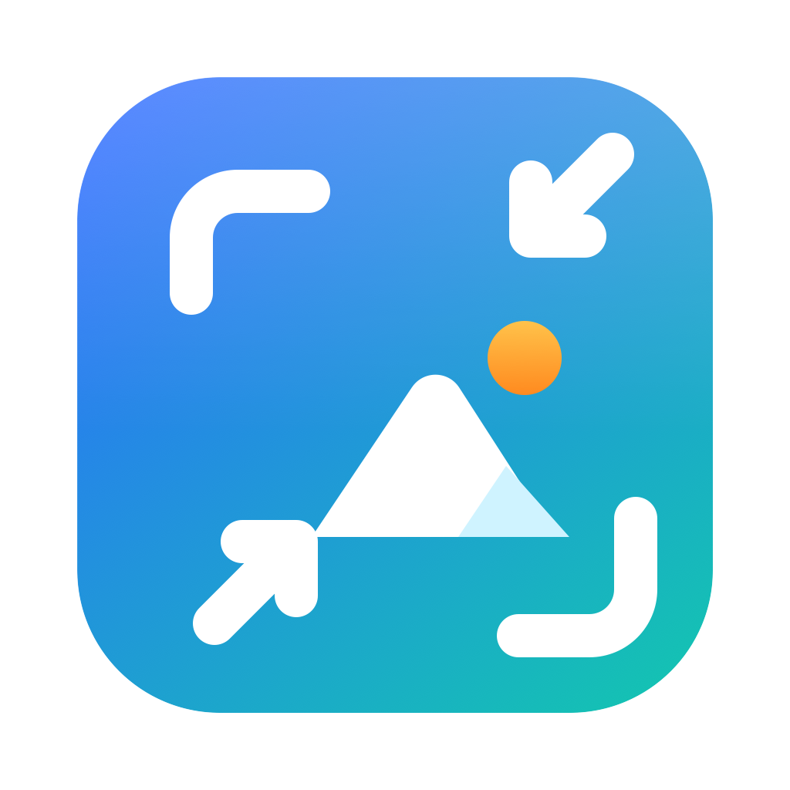

  

<h1 align="center">OptimosApp</h1>

<em>Capture. Optimize. Convert.</em>

A macOS menu-bar app (macOS 14+, Apple silicon) to capture, annotate, optimize and convert images, plus the `optimos` command-line tool and the `OptimosCore` library behind them. By Tarik Omercehajic, released under the [MIT License](LICENSE); third-party components are listed in [THIRD-PARTY-NOTICES.md](THIRD-PARTY-NOTICES.md).

# OptimosApp — Capture. Optimize. Convert.

This repository currently holds `OptimosCore` (image pipeline) and the `optimos` CLI.
See `PRD.md` and `docs/superpowers/` for the product definition, specs and plans.

## Build prerequisites (macOS 14+, Apple Silicon)

    brew install webp oxipng pngquant libjpeg-turbo

## Build and test

    swift build
    swift test

## CLI

    swift run optimos optimize shot.png
    swift run optimos optimize shot.png --preset Website -o out/
    swift run optimos convert shot.png --to webp --quality 82 --max-width 1600
    swift run optimos presets list

## OptimosApp (menu-bar app)

A menu-bar app that captures the screen and puts an optimized PNG on the clipboard, or saves it to a folder you choose.

Prerequisites (macOS 14+, Apple Silicon): `brew install xcodegen webp oxipng pngquant libjpeg-turbo`.
If you rebuild repeatedly, creating `App/Config/Local.xcconfig` is strongly recommended: copy
`App/Config/Local.xcconfig.example` to it and set your team id (a free Apple ID "Apple Development"
certificate is enough). Without it the app is ad-hoc signed and gets a new identity on every rebuild,
so macOS keeps forgetting the Screen Recording permission.

    App/scripts/test.sh     # unit tests (ad-hoc signed, no certificate needed)
    App/scripts/run.sh      # build and launch the app

Default shortcuts (rebinding comes in a later release):

| Shortcut | Action |
|---|---|
| `⌃⌥⌘4` | Capture an area, or press Space to pick a window. A toolbar then appears next to the selection: **Copy** (`Enter` or `⌘C`), **Save** (`⌘S`) or **Cancel** (`Esc`). Drag the handles on the selection to resize it, or drag inside it to move it; dragging outside the toolbar starts a new selection while you have no annotations. The toolbar has two rows: below the annotation tools are **Format** (PNG, JPEG, WebP) and **Max size** menus for that capture (starting from Preferences), and **Share**, which opens the macOS share menu with the finished file. The toolbar also has annotation tools: select/move (`V`), rectangle (`R`), circle (`O`), arrow (`A`), line (`L`), text (`T`), highlight (`H`), numbered markers (`N`), and pixelate (`P`) or blur (`B`) to hide sensitive content, with colour and size pickers, `⌘Z` / `⇧⌘Z` undo and redo, and `Delete` to remove the selected annotation. Copy and Save include the annotations. |
| `⌃⌥⌘3` | Capture the screen under the mouse and copy it immediately |

Clicking **Save** opens a save panel to pick the folder and name. In **Preferences… > Saving** you can switch to autosaving instead; the folder you last picked (or `~/Pictures/Optimos/` if none) is then used. **Preferences** (menu-bar menu) also has launch at login, rebindable shortcuts, the optimizer defaults (level, format, max size, replace or copy, keep metadata) and the capture format and level. **Show Last Screenshot in Finder** in the menu reveals the last saved file.

Troubleshooting: if Screen Recording already shows OptimosApp as allowed but the app keeps asking (this
happens after rebuilds of an ad-hoc signed build), run `tccutil reset ScreenCapture app.optimos.OptimosApp`,
relaunch the app, and grant access again. To avoid this, create `App/Config/Local.xcconfig` (a free Apple ID
"Apple Development" certificate is enough).

These avoid macOS's own `⌘⇧3/4/5` so they work on first launch. Manual verification steps are in
`docs/manual-checks/capture-app.md`.

### Optimize Images window
**Optimize Images…** (menu-bar menu, or `⌃⌥⌘O` from anywhere) opens a window. While it is open, OptimosApp also shows in the Dock and Cmd-Tab so it is easy to find again. Drop images or folders (or use `+`) and they are optimized at once with the **Level** (Lossless, Balanced, Smallest), **Format** (keep, PNG, JPEG, WebP) and **Max size** (fit the longest side, never enlarging) shown in the bottom bar. It also reads HEIC, TIFF and BMP and converts them (HEIC to JPEG, TIFF and BMP to PNG, or any of PNG, JPEG and WebP if you choose a format); those originals are never replaced. Same-format files are replaced in place, and only if the result is smaller. Converted files are written next to the original with the new extension. **Undo** restores the originals and **Again** re-runs from them with the current settings; the backups are deleted when the window closes.

## Packaging a build to share
`App/scripts/package.sh` builds a Release app, bundles `oxipng`, `pngquant` and `jpegtran` with their libraries (so it needs no Homebrew), ad-hoc signs everything, runs a smoke test of the bundled tools, and writes `App/dist/OptimosApp-<version>.dmg` (prints its SHA-256). The result needs Apple silicon and **macOS 26 or later** (the Homebrew `jpegtran` is built for macOS 26) and is **not signed or notarized**: friends follow `docs/INSTALL.md` (also placed in the DMG as "READ ME FIRST.txt") to get past Gatekeeper. The app bundle carries the licenses of the bundled tools and the pngquant source offer under `Contents/Resources/licenses`. To release a new version change `MARKETING_VERSION` in `App/project.yml` first.

## Website
`website/` holds the static landing page (Next.js static export, Tailwind, shadcn/ui and shadcnspace blocks). `cd website && pnpm install && pnpm build` writes the plain HTML site to `website/out`. See `website/README.md`; release links live in `website/lib/site.ts`.

