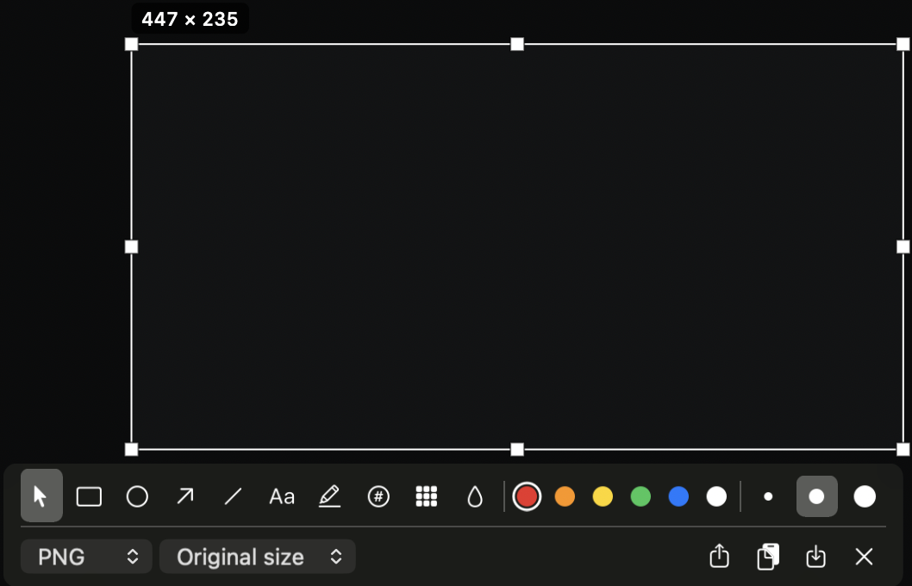
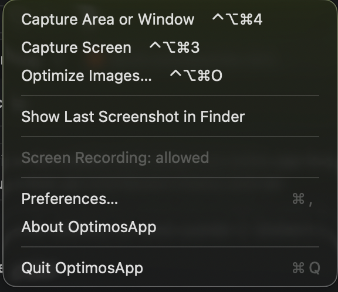
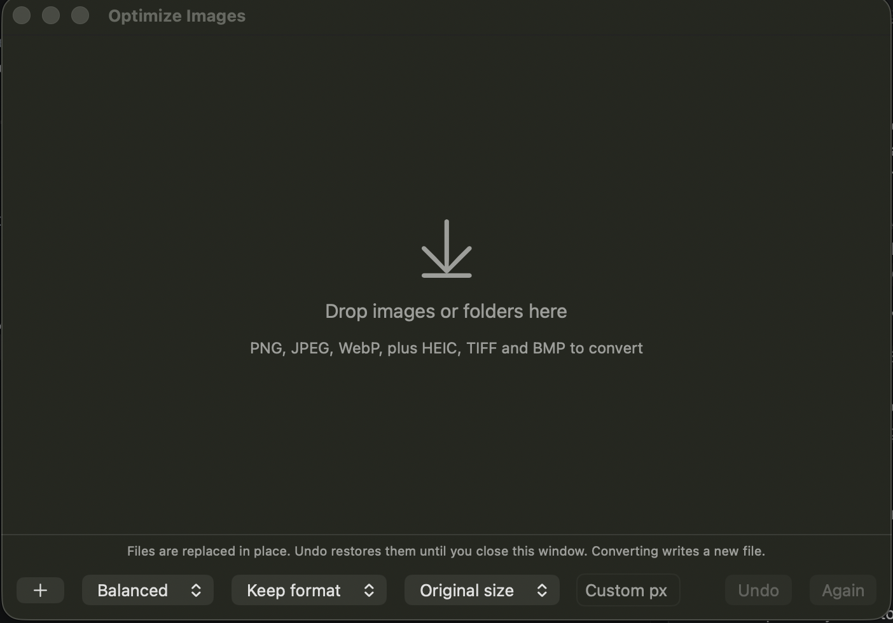

<p align="center">
  
</p>

<h1 align="center">OptimosApp</h1>

<p align="center"><em>Capture. Optimize. Convert.</em></p>

<p align="center">
  <a href="CHANGELOG.md"></a>
  <a href="LICENSE"></a>
  
  
  <a href="https://optimos.075codes.com"></a>
</p>

OptimosApp is a free Mac app that lives in your menu bar. Capture a screenshot, mark it up, and shrink it before it leaves your Mac. Drop in any image to make it smaller, or convert it to WebP, JPEG or PNG. Everything runs on your Mac and nothing is uploaded.

<p align="center">
  <a href="https://optimos.075codes.com"><strong>Download</strong></a> ·
  <a href="docs/INSTALL.md">Install guide</a> ·
  <a href="CHANGELOG.md">Changelog</a>
</p>

<p align="center">
  
  
</p>

## What it does

- **Capture** an area, a window or the whole screen with a shortcut. Drag the handles to resize the selection, or drag inside it to move it.
- **Annotate** with rectangles, circles, arrows, lines, text, highlights and numbered markers. Hide passwords and faces with pixelate or blur. Every mark can be moved, resized, recoloured and undone.
- **Optimize and convert** PNG, JPEG and WebP at three levels: Lossless, Balanced and Smallest. Open HEIC, TIFF and BMP and convert them. Cap the longest side so nothing is bigger than it needs to be.
- **Stay safe.** A file is replaced only when the result is smaller, and Undo restores every original until you close the window.
- **Copy, save or share.** Choose the format and size for each capture on the toolbar, then copy it, save it, or send it through the macOS share menu.
- **Stay private.** No account, no network access, no tracking. Hidden areas are destroyed, not just covered.

<p align="center">
  
</p>

## Install

1. Download the latest disk image from the **[website](https://optimos.075codes.com)** or the **[releases page](https://github.com/TarikTz/optimos/releases/latest)** and drag OptimosApp into Applications.
2. The app is not notarized by Apple yet, so macOS asks before the first launch. Run `xattr -dr com.apple.quarantine /Applications/OptimosApp.app`, or press **Open Anyway** in System Settings > Privacy & Security.
3. On the first capture, allow **Screen Recording**. OptimosApp offers to restart once, and then it works.

Requires a Mac with Apple silicon and macOS 26 or later. The full guide is in [docs/INSTALL.md](docs/INSTALL.md).

## Using it

| Shortcut | Action |
|---|---|
| `⌃⌥⌘4` | Capture an area. Press `Space` to pick a window instead. |
| `⌃⌥⌘3` | Copy the screen under the mouse. |
| `⌃⌥⌘O` | Open the Optimize Images window. |

You can change all three in **Preferences > Shortcuts**.

After you select an area, a toolbar appears. `Enter` or `⌘C` copies, `⌘S` saves, and `Esc` cancels. `⌘Z` and `⇧⌘Z` undo and redo, and `Delete` removes the selected mark. The tool keys are:

| Key | Tool | Key | Tool |
|---|---|---|---|
| `V` | Select and move | `T` | Text |
| `R` | Rectangle | `H` | Highlight |
| `O` | Circle | `N` | Numbered marker |
| `A` | Arrow | `P` | Pixelate |
| `L` | Line | `B` | Blur |

In **Optimize Images**, drop files or folders on the window. Same-format files are replaced in place, only when the result is smaller. Converted files are written next to the original with the new extension. **Undo** restores the originals, and **Again** re-runs them with new settings.

**Preferences** (in the menu) covers launch at login, where to save, shortcuts, and the defaults for the optimizer and for captures.

## Build from source

You need a Mac with Apple silicon, Xcode 16 or later, and Homebrew in `/opt/homebrew`.

```sh
brew install webp oxipng pngquant jpeg-turbo xcodegen
swift test                    # OptimosCore and the command-line tool
App/scripts/test.sh           # the app's unit tests
App/scripts/run.sh            # build and launch the app
```

The `optimos` command-line tool uses the same engine:

```sh
swift run optimos optimize shot.png
swift run optimos optimize shot.png --preset Website -o out/
swift run optimos convert shot.png --to webp --quality 82 --max-width 1600
swift run optimos presets list
```

### Signing and the Screen Recording permission

macOS ties the Screen Recording permission to the app's code signature. An ad-hoc signature changes with every build, so each rebuild looks like a new app and macOS asks again. Run `App/scripts/make-signing-cert.sh` once to create a free self-signed certificate, then copy `App/Config/Local.xcconfig.example` to `App/Config/Local.xcconfig`. Builds then keep one identity, and the permission survives rebuilds. Back up the certificate: signing a release with a different one means everyone grants the permission again.

### Packaging a release

`App/scripts/package.sh` builds a Release app, bundles `oxipng`, `pngquant` and `jpegtran` so it needs no Homebrew, signs it with the hardened runtime, smoke-tests the bundled tools, and writes `App/dist/OptimosApp-<version>.dmg`. To release a new version:

1. Change `MARKETING_VERSION` in `App/project.yml`, add the entry to `CHANGELOG.md`, and update the version badge above and `version` in `website/lib/site.ts`.
2. Run `App/scripts/package.sh`, then tag and push (`git tag -a vX.Y.Z -m "OptimosApp X.Y.Z" && git push origin main vX.Y.Z`).
3. Publish the release with both files: `gh release create vX.Y.Z App/dist/OptimosApp-X.Y.Z.dmg App/dist/OptimosApp.dmg --title "OptimosApp X.Y.Z" --notes-file notes.md`. The fixed name `OptimosApp.dmg` is what the website's Download button links to.
4. Redeploy the website (`DEPLOY_HOST=user@server website/scripts/deploy.sh`) so it shows the new version.

### Repository layout

| Path | Contents |
|---|---|
| `Sources/OptimosCore` | The image pipeline: decode, resize, convert, optimize. No UI. |
| `Sources/optimos` | The command-line tool. |
| `App/` | The menu-bar app (AppKit and SwiftUI) and its scripts. |
| `website/` | The landing page, a static Next.js site. |
| `docs/` | Install guide, manual test checklists, security review. |

## Contributing and security

Contributions are welcome. Read [CONTRIBUTING.md](CONTRIBUTING.md) first. To report a vulnerability, follow [SECURITY.md](SECURITY.md); a review of the code and its fixes is in [docs/security-review.md](docs/security-review.md).

## License

OptimosApp is released under the [MIT License](LICENSE). It uses and bundles open-source tools under their own licenses: `oxipng` (MIT), `pngquant` (GPL-3.0-or-later, run as a separate program), `libjpeg-turbo` (BSD and IJG) and `libwebp` (BSD). See [THIRD-PARTY-NOTICES.md](THIRD-PARTY-NOTICES.md).

Made by Tarik Omercehajic.
